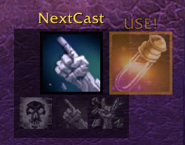
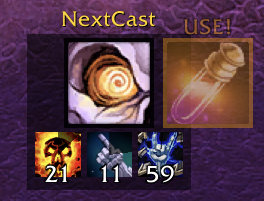
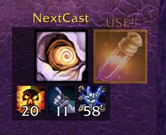
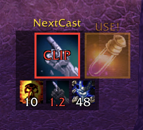

# NextCast

A tiny, movable "what do I cast next?" box for **Shadow Priests** on TBC Classic (Anniversary).

## Screenshots

| | |
|---|---|
|  |  |
| *Opener suggestion on a fresh target* | *DoTs running with time remaining* |
|  |  |
| *Tracker mid-fight* | *Red CLIP signal: cut the Mind Flay channel now* |

## What it does

- **Next-cast icon** — one icon showing the spell you should press next, following the
  standard TBC shadow priority: Shadowform → Vampiric Touch → Shadow Word: Pain →
  Vampiric Embrace → Mind Blast → Shadow Word: Death → Shadowfiend (low mana) → Mind Flay.
- **Predictive** — reads your cast bar and evaluates cooldowns and DoT timers *as of the
  moment your current cast finishes*, so mid-cast it already shows your next press.
  DoT refreshes are timed so the new application lands right after the old one's final
  tick (haste-aware, so the window tightens under Bloodlust).
- **DoT tracker** — your SW:P / VT / VE on the target, with cooldown-sweep overlays and
  remaining time (red under 3 seconds).
- **Mind Flay clip signal** — once your 2nd flay tick has fired and something better is
  ready, the border turns red with a "CLIP" label: cut the channel now.
- **Burst alert** — during Bloodlust/Heroism, a pulsing pop-out suggests Destruction
  Potion (if in bags and off the potion cooldown), then any equipped on-use trinket
  that's ready.
- **SW:D safety** — estimates the worst-case crit backlash from your rank, shadow spell
  power, and damage modifiers; when it could kill you, the Shadow Word: Death suggestion
  is shown with a red danger overlay so casting it is your informed call.
- Only suggests spells you actually know, so it works while leveling too.

This is a **suggestion display only** — it never casts anything for you, which keeps it
fully within Blizzard's addon policy.

## Commands

`/nextcast` or `/nc`

| Command | Effect |
|---|---|
| `/nc unlock` / `/nc lock` | Unlock to drag the box, lock it in place |
| `/nc hide` / `/nc show` | Hide or show the box entirely |
| `/nc reset` | Reset position |
| `/nc scale <0.5–3>` | Resize |
| `/nc swd` | Toggle Shadow Word: Death suggestions |
| `/nc ve` | Toggle Vampiric Embrace suggestions |
| `/nc fiend` | Toggle Shadowfiend (low-mana) suggestions |
| `/nc lust` | Toggle potion/trinket alerts during Lust/Heroism |
| `/nc clip` | Toggle the Mind Flay clip indicator |

## Installation

Copy the `NextCast` folder into
`World of Warcraft/_anniversary_/Interface/AddOns/` and restart the client.

## Known limitations

- The burst alert suggests **any** equipped on-use trinket — including a PvP Medallion.
- Only Bloodlust/Heroism trigger the burst alert (not Drums of Battle or Power Infusion).
- Shadow Priest only, for now.
